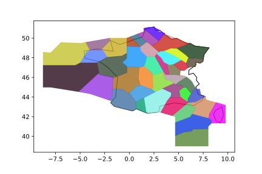

# Analysis of Air Traffic Control en-route sectors of Metropolitan France

Air traffic control sectors data are extracted from the [SIA website](https://www.sia.aviation-civile.gouv.fr) in the eAIP section (ENR 3.8) 
A basic analysis is then realized with [GeoPandas](http://geopandas.org/) 
The following questions are notably addressed:
* How many Area Control Centers (ACC), sectors and airspace volumes over Metropolitan France?
* How many volumes and sectors per ACC?
* Which are the largest and smallest airspace volumes and elementary sectors?
* Which flight levels are used (per ACC)?
* Which elementary sectors are composed of most different volumes?

Example: display all airspace volumes at FL350

## Running the tests

You can first generate sectors and volumes files (sectors.csv and volumes.geojson) with tables_building.ipynb, 
and then run the analysis with atc_sector_analysis.ipynb

## Built With

* [GeoPandas](http://geopandas.org/) - GeoPandas is an open source project which extends the datatypes used by pandas to allow spatial operations on geometric types. 
* [Beautiful Soup](https://www.crummy.com/software/BeautifulSoup/bs4/doc/) - Python library for pulling data out of HTML and XML files

## Authors

* **Thomas Dubot** 

## License

This project is licensed under the MIT License - see the [LICENSE.md](LICENSE.md) file for details

## Acknowledgments

eAIP is provided by the French Aeronautical Information Service  [SIA](https://www.sia.aviation-civile.gouv.fr)

